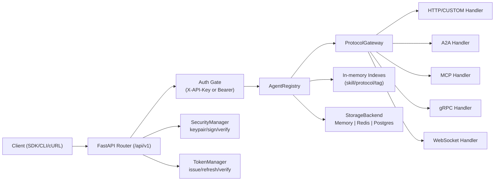
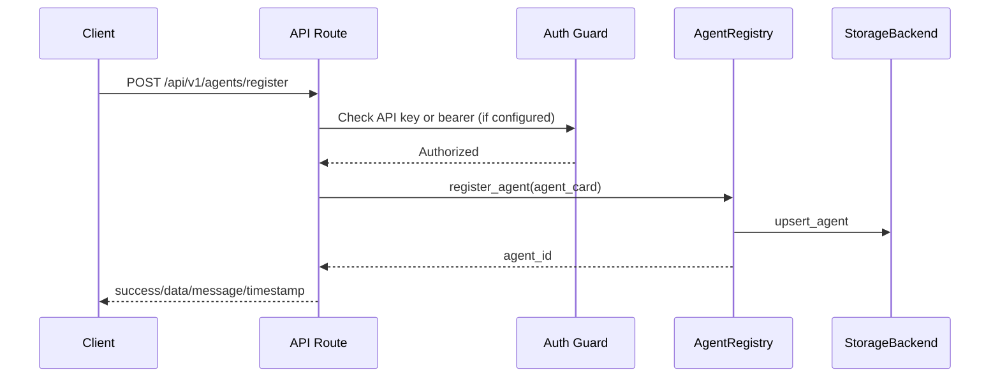
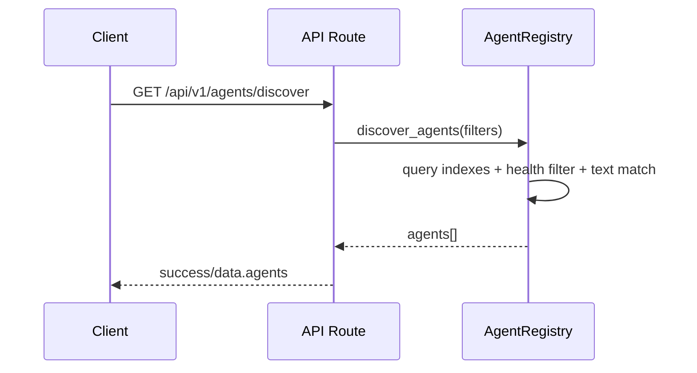
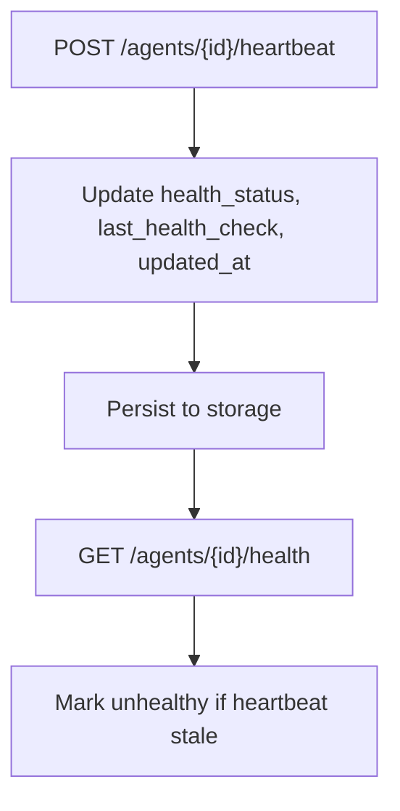
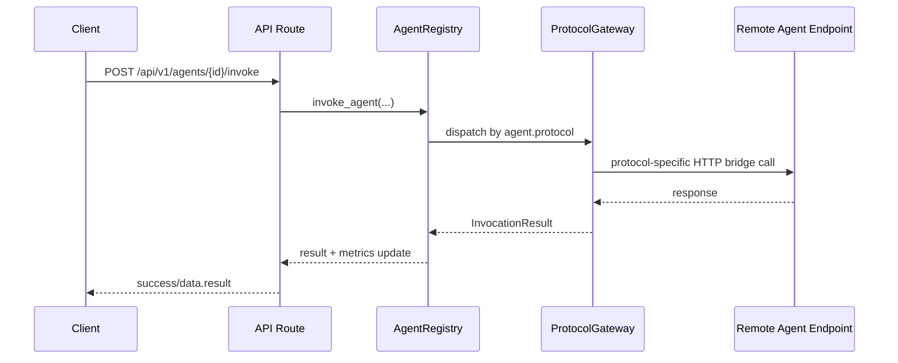

# AgentMesh Architecture Diagrams

## 1. Runtime Components

```mermaid
flowchart LR
    C["Client (SDK/CLI/cURL)"] --> API["FastAPI Router (/api/v1)"]
    API --> AUTH["Auth Gate\n(X-API-Key or Bearer)"]
    AUTH --> REG["AgentRegistry"]
    REG --> GW["ProtocolGateway"]
    GW --> PHTTP["HTTP/CUSTOM Handler"]
    GW --> PA2A["A2A Handler"]
    GW --> PMCP["MCP Handler"]
    GW --> PGRPC["gRPC Handler"]
    GW --> PWS["WebSocket Handler"]
    REG --> IDX["In-memory Indexes\n(skill/protocol/tag)"]
    REG --> STORE["StorageBackend\nMemory | Redis | Postgres"]
    API --> SEC["SecurityManager\nkeypair/sign/verify"]
    API --> TOK["TokenManager\nissue/refresh/verify"]
```

## 2. Register Flow

```mermaid
sequenceDiagram
    participant Client
    participant API as API Route
    participant Auth as Auth Guard
    participant Reg as AgentRegistry
    participant Store as StorageBackend

    Client->>API: POST /api/v1/agents/register
    API->>Auth: Check API key or bearer (if configured)
    Auth-->>API: Authorized
    API->>Reg: register_agent(agent_card)
    Reg->>Store: upsert_agent
    Reg-->>API: agent_id
    API-->>Client: success/data/message/timestamp
```

## 3. Discovery Flow

```mermaid
sequenceDiagram
    participant Client
    participant API as API Route
    participant Reg as AgentRegistry

    Client->>API: GET /api/v1/agents/discover
    API->>Reg: discover_agents(filters)
    Reg->>Reg: query indexes + health filter + text match
    Reg-->>API: agents[]
    API-->>Client: success/data.agents
```

## 4. Heartbeat and Health

```mermaid
flowchart TD
    HB["POST /agents/{id}/heartbeat"] --> UPDATE["Update health_status, last_health_check, updated_at"]
    UPDATE --> SAVE["Persist to storage"]
    SAVE --> HEALTH["GET /agents/{id}/health"]
    HEALTH --> CHECK["Mark unhealthy if heartbeat stale"]
```

## 5. Protocol Invoke Flow

```mermaid
sequenceDiagram
    participant Client
    participant API as API Route
    participant Reg as AgentRegistry
    participant GW as ProtocolGateway
    participant Remote as Remote Agent Endpoint

    Client->>API: POST /api/v1/agents/{id}/invoke
    API->>Reg: invoke_agent(...)
    Reg->>GW: dispatch by agent.protocol
    GW->>Remote: protocol-specific HTTP bridge call
    Remote-->>GW: response
    GW-->>Reg: InvocationResult
    Reg-->>API: result + metrics update
    API-->>Client: success/data.result
```
