# AgentMesh Architecture Diagrams

Visual representations of AgentMesh architecture and data flow.

## 🏗️ System Architecture

### High-Level Architecture

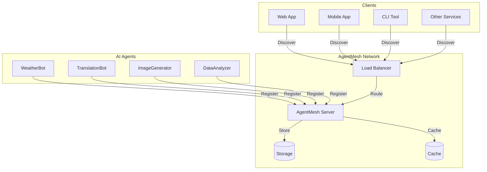

### Component Architecture

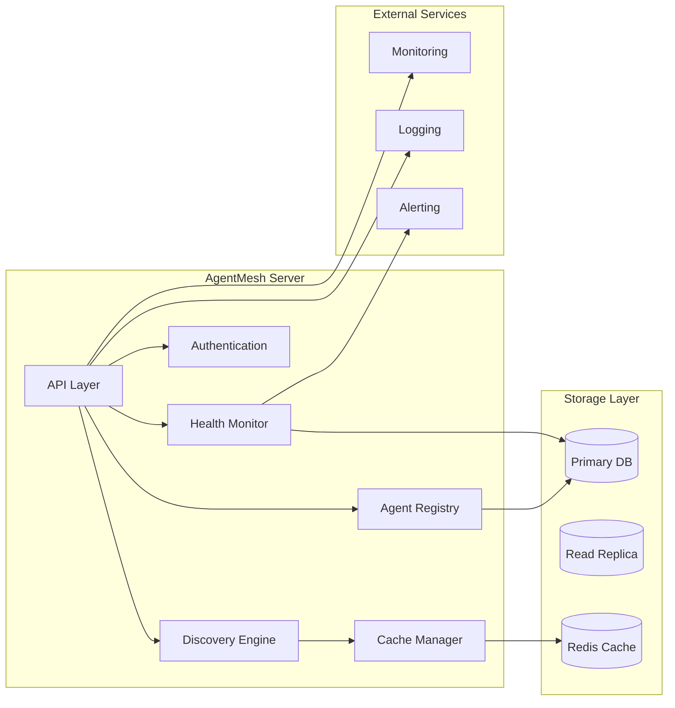

## 🔄 Data Flow

### Agent Registration Flow

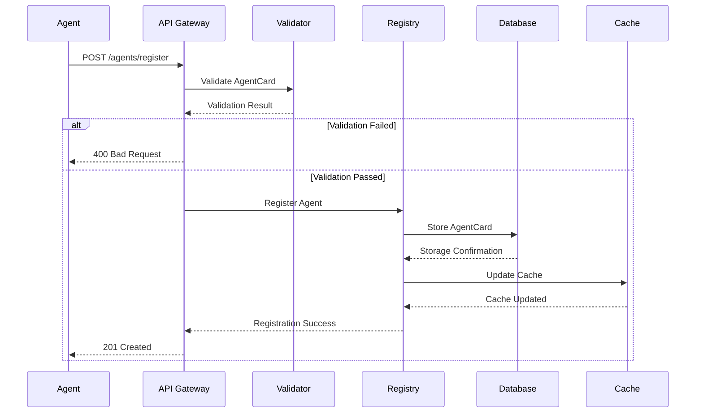

### Agent Discovery Flow

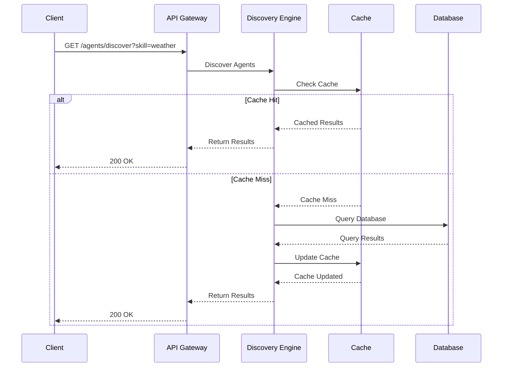

### Health Monitoring Flow

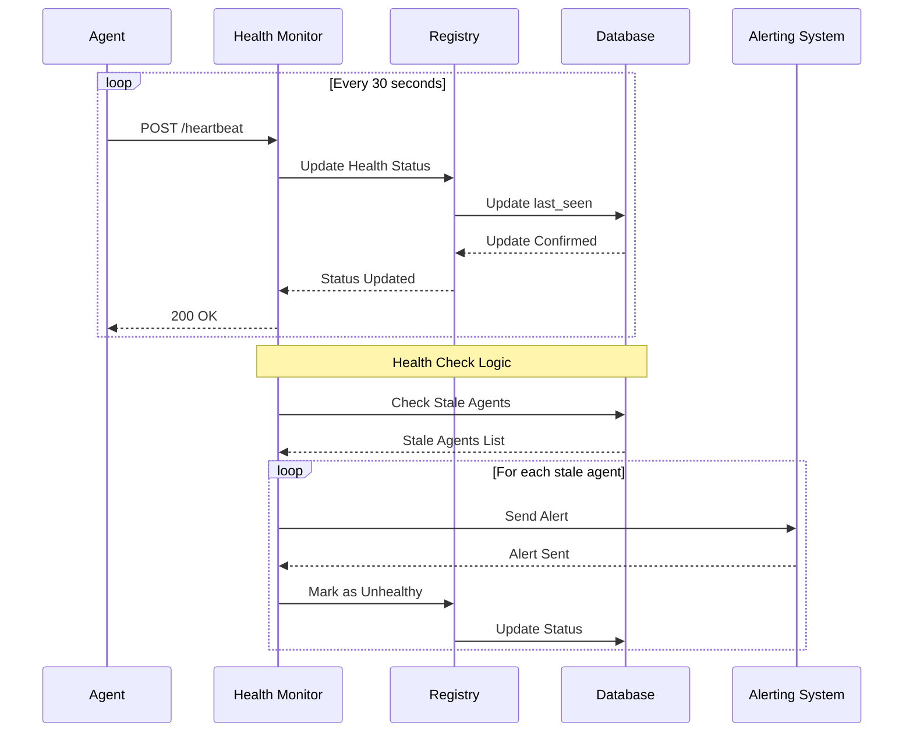

## 🏢 Deployment Architecture

### Single Server Deployment

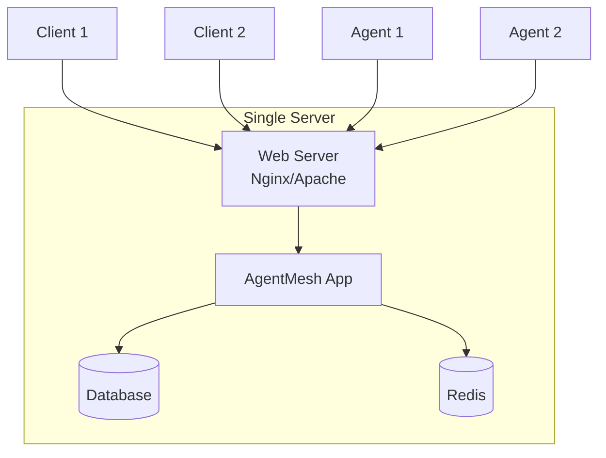

### High Availability Deployment

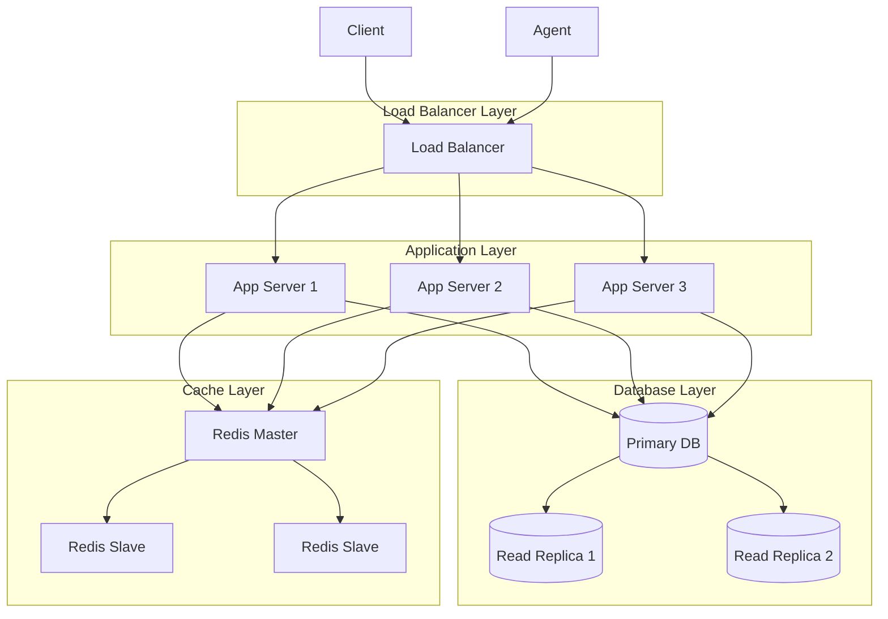

### Kubernetes Deployment

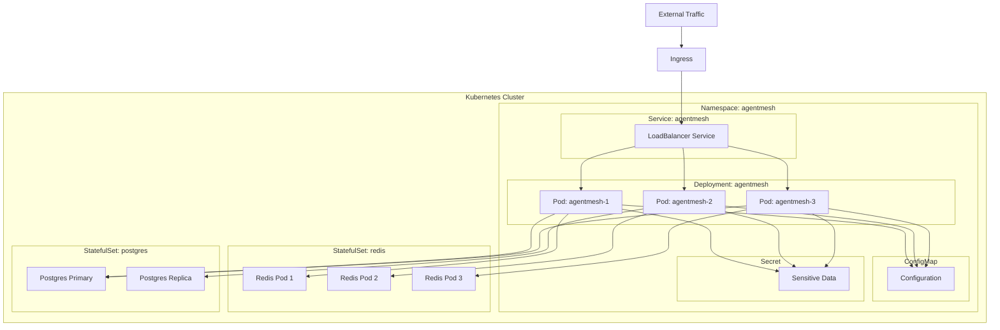

## 📊 Data Models Relationship

### AgentCard Relationships

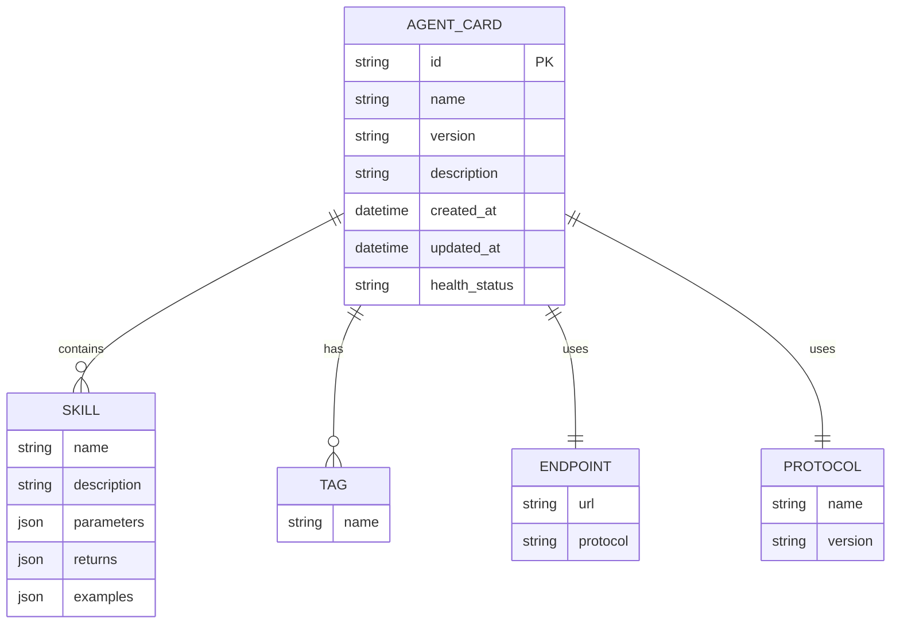

### Database Schema

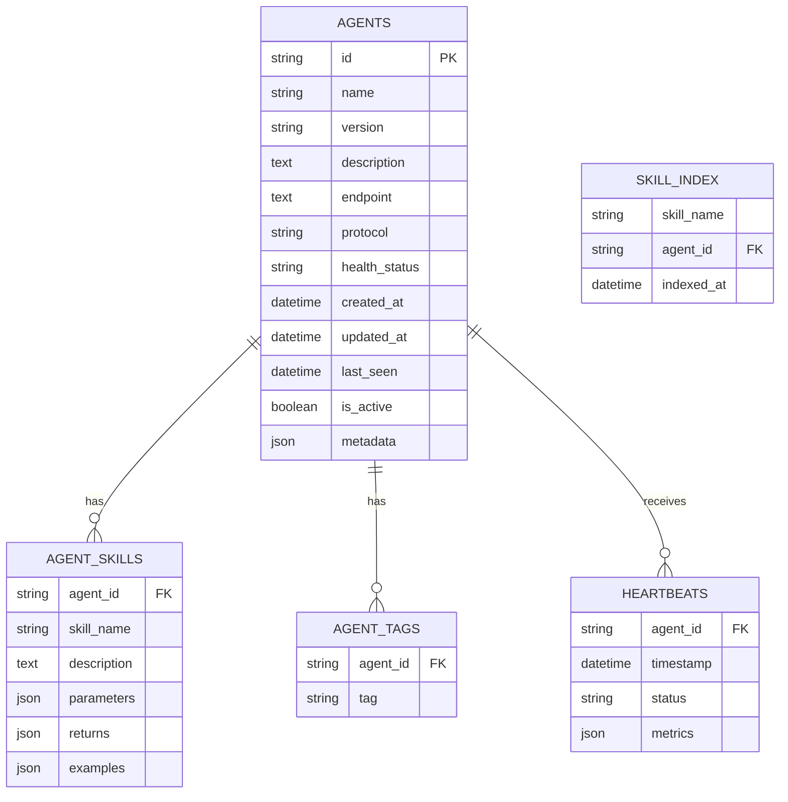

## 🔐 Security Architecture

### Authentication Flow

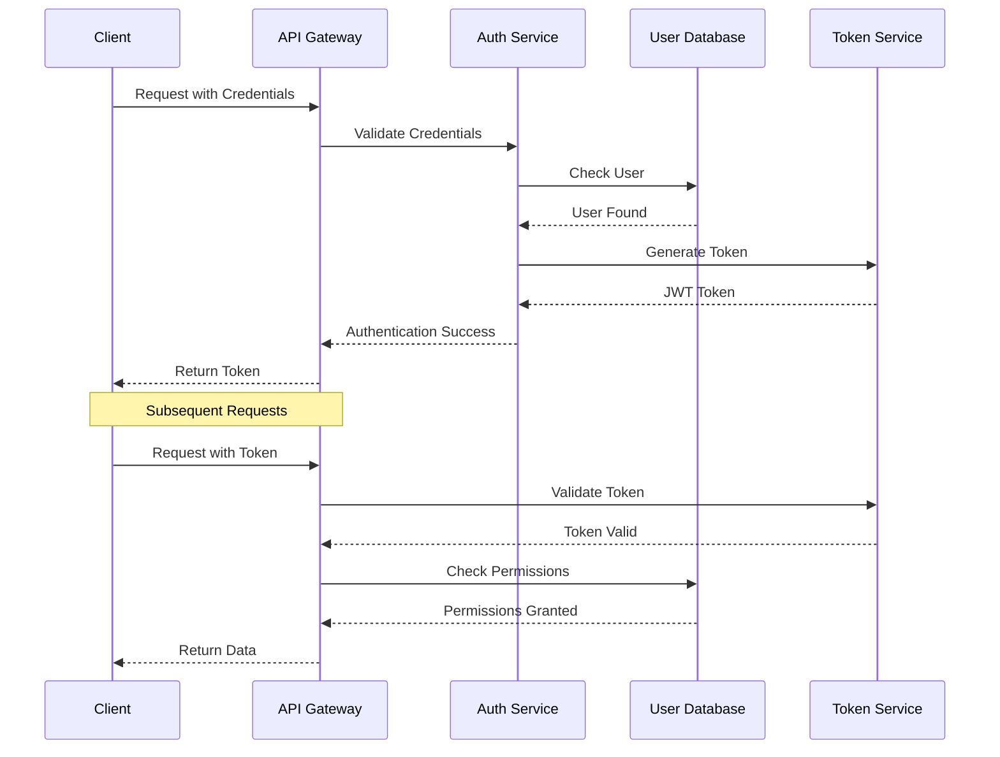

### Network Security Zones

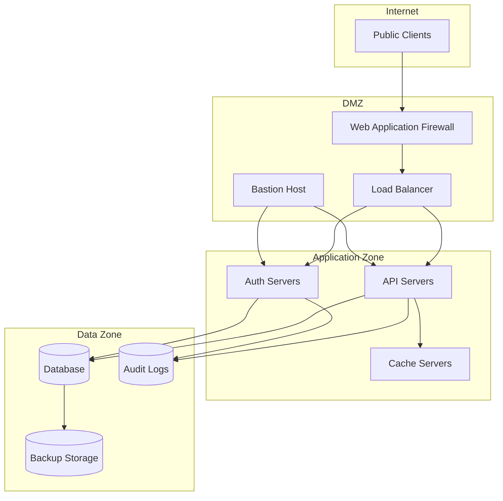

## 📈 Monitoring Architecture

### Monitoring Stack

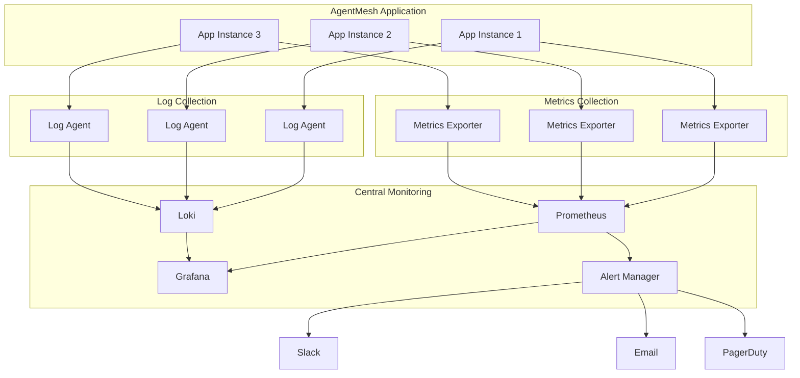

## 🔄 CI/CD Pipeline

### Deployment Pipeline

```mermaid
graph LR
    subgraph "Development"
        Code[Code Changes]
        PR[Pull Request]
        Review[Code Review]
    end
    
    subgraph "CI Pipeline"
        Test[Run Tests]
        Lint[Code Linting]
        Build[Build Image]
        Scan[Security Scan]
    end
    
    subgraph "CD Pipeline"
        Stage[Staging Deployment]
        TestStage[Staging Tests]
        Prod[Production Deployment]
        Monitor[Production Monitoring]
    end
    
    Code --> PR
    PR --> Review
    Review --> Test
    Test --> Lint
    Lint --> Build
    Build --> Scan
    Scan --> Stage
    Stage --> TestStage
    TestStage --> Prod
    Prod --> Monitor
```

## 🎨 Color Legend

### Diagram Color Coding

| Color | Meaning | Example |
|-------|---------|---------|
| 🔵 **Blue** | External Components | Clients, Users |
| 🟢 **Green** | Core Components | AgentMesh Server, Database |
| 🟡 **Yellow** | Supporting Services | Cache, Load Balancer |
| 🔴 **Red** | Security Components | Firewall, Auth Service |
| 🟣 **Purple** | Monitoring Components | Metrics, Logging |
| 🟠 **Orange** | Deployment Components | Kubernetes, Docker |

### Line Style Legend

| Style | Meaning | Example |
|-------|---------|---------|
| **Solid** | Primary Data Flow | API Requests |
| **Dashed** | Secondary Data Flow | Cache Updates |
| **Dotted** | Control Flow | Health Checks |
| **Thick** | High Priority | Critical Alerts |

## 📝 How to Use These Diagrams

### For Documentation
```markdown
Include diagrams in your documentation:

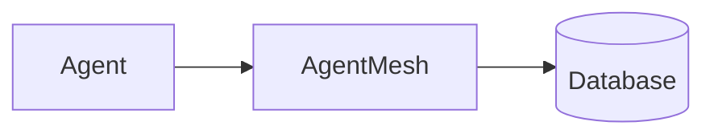

### For Presentations
1. Use high-level architecture diagrams for executive summaries
2. Use detailed flow diagrams for technical discussions
3. Use deployment diagrams for operations teams

### For Development
1. Reference data model diagrams when designing schemas
2. Use sequence diagrams for API design
3. Reference security diagrams for threat modeling

## 🔧 Generating Diagrams

### Tools
1. **Mermaid.js**: Used in these diagrams
2. **PlantUML**: Alternative diagram tool
3. **Draw.io**: Visual diagram editor
4. **Excalidraw**: Hand-drawn style diagrams

### Integration
```yaml
# In mkdocs.yml for documentation site
markdown_extensions:
  - pymdownx.superfences:
      custom_fences:
        - name: mermaid
          class: mermaid
          format: !!python/name:pymdownx.superfences.fence_code_format
```

## 📚 Related Documentation

- [Protocol Specification](protocol_specification.md)
- [API Reference](api_reference.md)
- [Data Models](data_models.md)
- [Deployment Guide](../deployment/guide.md)

---

*Diagrams last updated: February 23, 2026*